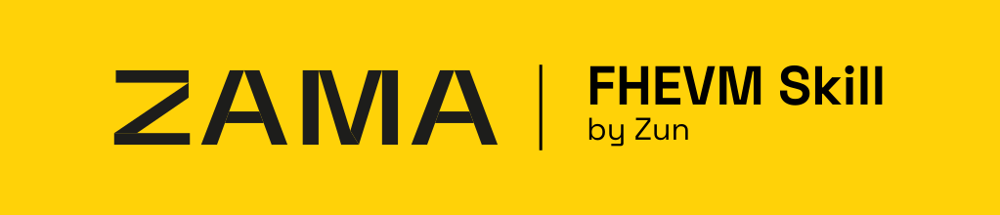

<h1 align="center">Zama Skill for AI coding agents</h1>

<p align="center">
Build, audit, and deploy confidential smart contracts with <a href="https://docs.zama.org/protocol">Zama FHEVM</a> v0.11 across Claude Code, Codex CLI, Cursor, Windsurf, and any AGENTS.md-aware tool.
</p>

<p align="center">
  
</p>

<p align="center">
  
  
  
  
  
  
  
  
</p>

<br>

---

## ✨ Quick start

Run one command in your project root:

```bash
npx zama-skill claude       # Claude Code (.claude/)
npx zama-skill codex        # Codex CLI (.agents/ + AGENTS.md)
npx zama-skill cursor       # Cursor (.cursor/ + AGENTS.md)
npx zama-skill windsurf     # Windsurf (.windsurfrules + .agents/)
npx zama-skill other        # any other AGENTS.md tool: Aider, Cline, Continue, Zed, Jules, ...
```

## 🗣️ Sample prompts

**1. Generate a contract**

```text
Write a confidential ERC-7984 token with encrypted balances and owner-only mint
```

**2. Review code**

```text
Review contracts/Vault.sol for FHE-specific bugs and ACL gaps
```

**3. Generate tests**

```text
Write Hardhat tests for contracts/ConfidentialERC20.sol covering mint, transfer, and operator flow
```

**4. Deploy**

```text
Set up a new FHEVM project with Hardhat and deploy a confidential ERC-7984 to Sepolia
```

**5. Security audit**

```text
Audit all contracts in contracts/ for FHE vulnerabilities
```

**6. Frontend / dApp**

```text
Write a React component that encrypts a bid amount and sends it to my SealedAuction contract using the relayer SDK
```

<br>

---

## 📦 Installation

Pick one path. The quick install needs Node.js 20+ (per `package.json` `engines.node`); the manual install needs nothing but `git` and `cp`.

### 1. Quick install (recommended)

Run from your project root. One command per agent, no clone needed:

```bash
npx zama-skill claude       # Claude Code (.claude/)
npx zama-skill codex        # Codex CLI (.agents/ + AGENTS.md)
npx zama-skill cursor       # Cursor (.cursor/ + AGENTS.md)
npx zama-skill windsurf     # Windsurf (.windsurfrules + .agents/)
npx zama-skill other        # any other AGENTS.md tool: Aider, Cline, Continue, Zed, Jules, ...
```

The CLI prints every file it copies and refuses to overwrite existing files. Useful flags:

| Flag | Effect |
| :--- | :--- |
| `--target <path>` | Install into `<path>` instead of the current directory |
| `--force` | Overwrite existing files |
| `--dry-run` | Print the file list without writing anything |
| `--help` / `--version` | Show usage / package version |

To upgrade later, pin `@latest` so npx bypasses its package cache: `npx zama-skill@latest <agent> --force`.

### 2. Manual install (no Node.js required)

Clone the repo and copy the bundle for your tool. Run all commands below **from inside the cloned `zama-skill/` directory**. Replace `/path/to/your-project` with your project's absolute path. Pick only the sections for the AI tools you actually use; they are independent of each other.

```bash
git clone https://github.com/zunmax/zama-skill.git
cd zama-skill
```

<details>
<summary><b>Claude Code</b></summary>

<br>

The Claude bundle is fully self-contained in `.claude/`. Copy the whole directory:

```bash
cp -r .claude /path/to/your-project/
```

That places `.claude/CLAUDE.md` (entry-point) and `.claude/skills/zama-skill/` (skill) into your project. Claude Code auto-discovers both. The skill triggers on imports of `@fhevm/solidity`, `@zama-fhe/relayer-sdk`, `@zama-fhe/sdk`, `@zama-fhe/react-sdk`, or `@openzeppelin/confidential-contracts`, encrypted types (`euint*`, `ebool`, `eaddress`), or any FHEVM-related error string.

Or ask the agent to install:

> Install the Zama Skill from https://github.com/zunmax/zama-skill and set it up for my project

</details>

<details>
<summary><b>Codex CLI</b></summary>

<br>

The Codex bundle lives in `.agents/`. The shared root `AGENTS.md` is the entry point Codex reads from your project root.

```bash
cp -r .agents /path/to/your-project/
cp AGENTS.md /path/to/your-project/
```

The skill auto-loads from `.agents/skills/zama-skill/SKILL.md`. It ships its own `references/`, `templates/`, and `review-modules/`. No Claude or Cursor install required.

</details>

<details>
<summary><b>Cursor</b></summary>

<br>

The Cursor bundle lives in `.cursor/`. Same shared root `AGENTS.md`.

```bash
cp -r .cursor /path/to/your-project/
cp AGENTS.md /path/to/your-project/
```

Three rule files in `.cursor/rules/` activate automatically:
- `fhevm-solidity.mdc` auto-attaches on `*.sol` files
- `fhevm-testing.mdc` auto-attaches on `*.test.ts` / `*.spec.ts` files
- `fhevm-frontend.mdc` is description-matched (agent requested) to avoid firing on every `.ts` file in non-FHEVM projects

`.cursor/references/`, `.cursor/templates/`, `.cursor/review-modules/`, and `.cursor/scripts/` ship with the bundle. No Claude or Codex install required.

</details>

<details>
<summary><b>Windsurf</b></summary>

<br>

Windsurf reads a single `.windsurfrules` file at the project root. The full reference set ships under `.agents/`, which the rules link to.

```bash
cp .windsurfrules /path/to/your-project/
cp -r .agents /path/to/your-project/
```

`.windsurfrules` carries the ALWAYS / ASK FIRST / NEVER list, source-verified hard limits, the post-delivery grep, and the lint command. Detail (anti-patterns, types, ACL, decryption, frontend, testing, deployment, vulnerability catalogs) lives in `.agents/skills/zama-skill/`.

</details>

<details>
<summary><b>Other Agents</b></summary>

<br>

`AGENTS.md` is becoming a cross-tool standard. Any agent that reads it can use this skill; it just needs the references and templates reachable on disk. Use the `.agents/` bundle as the generic mirror:

```bash
cp -r .agents /path/to/your-project/
cp AGENTS.md /path/to/your-project/
```

`AGENTS.md` routes the agent to `.agents/skills/zama-skill/SKILL.md` as the default fallback for any non-Codex, non-Cursor tool. If your tool does not auto-discover sub-files, point it at `AGENTS.md` first and ask it to read `.agents/skills/zama-skill/SKILL.md` for the workflows.

</details>

---

## 🔼 Update to the latest version

Quick install : re-run with `@latest` to bypass npx's package cache: `npx zama-skill@latest <agent> --force`.

Manual install :

```bash
cd zama-skill && git pull
# then re-run the cp commands above for the agent(s) you use
```

Each install is a snapshot. Re-copy (or re-run the npx command with `--force`) to pull the latest patterns.

---

## 📁 Repository layout

```
zama-skill/                    # this repo after `git clone`
│
├── README.md               # this file
├── LICENSE                 # MIT
├── AGENTS.md               # Cross-tool entry point (Codex CLI / Cursor / other AGENTS.md tools)
├── package.json            # npm manifest (name, bin, files allowlist)
│
├── assets/                 # README assets
│   └── banner.svg
│
├── bin/
│   └── cli.js              # `npx zama-skill` installer entry point
│
├── .github/
│   └── workflows/
│       └── publish.yml     # tag-triggered npm publish with provenance
│
├── .claude/                # Claude Code bundle (self-contained)
│   ├── CLAUDE.md           # entry point (auto-discovered by Claude Code)
│   └── skills/zama-skill/
│       ├── SKILL.md        # orchestrator (7 workflows)
│       ├── LICENSE.txt
│       ├── references/     # 22 reference docs (15 core + 7 new-SDK)
│       ├── templates/      # 3 contract templates
│       ├── review-modules/ # 7 audit modules + audit-protocol.md
│       └── scripts/        # fhe-lint.js (mechanical anti-pattern lint)
│
├── .agents/                # Codex / Windsurf bundle (mirror of .claude/skills/zama-skill/)
│   └── skills/zama-skill/
│       ├── SKILL.md
│       ├── LICENSE.txt
│       ├── references/
│       ├── templates/
│       ├── review-modules/
│       └── scripts/
│
├── .cursor/                # Cursor bundle (rules + same references / templates / review-modules / scripts)
│   ├── LICENSE.txt
│   ├── rules/              # fhevm-solidity.mdc, fhevm-testing.mdc, fhevm-frontend.mdc
│   ├── references/
│   ├── templates/
│   ├── review-modules/
│   └── scripts/
│
└── .windsurfrules          # Windsurf entry point (loads alongside .agents/)
```

<br>

---

## 📄 License

MIT. See [LICENSE](LICENSE).